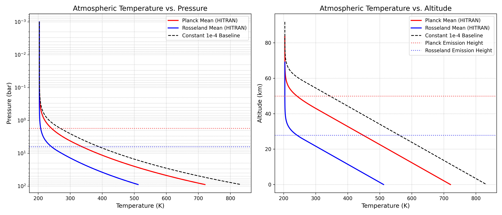

# Scenario: Earth at Venus's Orbit with a 90-Bar Dry-Air Atmosphere (HITRAN-Supported)

This directory contains the physical model, calculations, and simulation code for a hypothetical scenario where Earth is moved to Venus's orbit (0.723 AU) and its atmospheric mass is increased to reach a surface pressure ($P_s$) of 90 bar. The atmospheric composition is kept strictly identical to modern dry air ($\sim 78\% \text{ N}_2$, $\sim 21\% \text{ O}_2$, $\sim 1\% \text{ Ar}$), and the oceans are absent.

The calculations are supported directly by the **HITRAN database** for collision-induced absorption (CIA).

## The Original Prompt / Scenario

> **Planetary Scenario:** Earth is moved to Venus's orbit.
> 
> ### Core Astronomical & Orbital Parameters
> * **Planetary Distance:** $d = 0.723 \text{ AU}$
> * **Base Solar Constant at 1 AU:** $S_0 = 1361 \text{ W/m}^2$
> * **Gravitational Acceleration:** $g = 9.81 \text{ m/s}^2$
> 
> ### The Scenario: The 90-Bar Dry-Air Atmosphere
> Earth's atmospheric mass is increased to reach a surface pressure ($P_s$) of 90 bar at sea level, but its composition is kept strictly identical to modern dry air ($\sim 78\% \text{ N}_2$, $\sim 21\% \text{ O}_2$, $\sim 1\% \text{ Ar}$). Earth's oceans are completely suppressed or absent.
> 
> ### Physical Mechanisms:
> 1. **Solar Forcing & Albedo:** Calculate the incident solar radiation at $0.723 \text{ AU}$. Account for the extreme Rayleigh scattering caused by a 90-bar diatomic column, which significantly raises the planetary spherical albedo ($\alpha$) to a range of $0.6 \text{ to } 0.7$. Use $\alpha = 0.7$ for consistency. Calculate the resulting planetary equilibrium temperature ($T_{eq}$).
> 2. **Infrared Opacity via Collision-Induced Absorption (CIA):** While $\text{N}_2$ and $\text{O}_2$ are transparent to thermal IR at 1 bar, explicitly account for the fact that at 90 bar, the probability of collisions induces temporary dipole moments. Because CIA opacity scales non-linearly with the square of the density ($\rho^2$), the atmosphere becomes opaque to thermal IR. Identify the effective emission level and surface temperature.

---

## Physical Derivation & Calculations

### 1. Solar Forcing & Equilibrium Temperature ($T_{eq}$)

The solar flux $S$ at a distance $d = 0.723 \text{ AU}$ is determined by the inverse-square law:
$$S = S_0 \left(\frac{1\text{ AU}}{d}\right)^2 = 1361 \text{ W/m}^2 \times \left(\frac{1}{0.723}\right)^2 \approx 2603.64 \text{ W/m}^2$$

With a planetary spherical albedo $\alpha = 0.7$, the planet reflects $70\%$ of the incoming radiation back to space, primarily due to intense Rayleigh scattering by the dense 90-bar diatomic atmosphere. The net absorbed solar radiation per unit surface area (averaged over the sphere) is:
$$F_{\text{abs}} = \frac{S (1 - \alpha)}{4} = \frac{2603.64 \times (1 - 0.7)}{4} \approx 195.27 \text{ W/m}^2$$

At thermal equilibrium, the outgoing longwave radiation (OLR) must balance the net absorbed solar radiation:
$$\text{OLR} = F_{\text{abs}} = 195.27 \text{ W/m}^2$$

The planetary equilibrium temperature ($T_{eq}$), representing the effective temperature at which the planet radiates as a blackbody to space, is:
$$T_{eq} = \left(\frac{\text{OLR}}{\sigma}\right)^{1/4} = \left(\frac{195.27 \text{ W/m}^2}{5.6704 \times 10^{-8} \text{ W/m}^2/\text{K}^4}\right)^{1/4} \approx 242.25 \text{ K} \quad (-30.90\text{ }^\circ\text{C})$$

---

### 2. Vertical Atmospheric Structure

To resolve the temperature profile, we construct a 1D radiative-convective equilibrium model. The atmosphere is divided into two primary zones:
1. **The Stratosphere (Radiative Equilibrium):** Above the tropopause ($P \le P_t$), heat transport is purely radiative. Under the grey-atmosphere Eddington approximation, the temperature profile is:
   $$T^4(\tau) = T_{eq}^4 \left(\frac{3}{4}\tau + \frac{1}{2}\right)$$
   where $\tau$ is the infrared optical depth measured downward from the top of the atmosphere.
2. **The Troposphere (Convective Equilibrium):** Below the tropopause ($P > P_t$), the steep radiative temperature gradient is unstable to convection. Because the atmosphere is dry (no water vapor or condensation), the temperature profile follows the dry adiabat:
   $$T(P) = T_t \left(\frac{P}{P_t}\right)^\kappa$$
   where $\kappa = \frac{R_d}{C_p}$ is the adiabatic index, $T_t$ is the tropopause temperature, and $P_t$ is the tropopause pressure.

#### Atmospheric Properties of Dry Air:
* **Mean Molecular Weight ($M$):** For $\sim 78\%\text{ N}_2$, $\sim 21\%\text{ O}_2$, $\sim 1\%\text{ Ar}$, and trace $\text{CO}_2$:
  $$M \approx 28.965 \text{ g/mol} = 0.028965 \text{ kg/mol}$$
* **Specific Gas Constant ($R_d$):**
  $$R_d = \frac{R}{M} \approx 287.05 \text{ J/(kg K)}$$
* **Specific Heat Capacity ($C_p$):** For diatomic molecules $\text{N}_2$ and $\text{O}_2$, the molar heat capacity is $C_{p,m} = \frac{7}{2}R$; for monatomic $\text{Ar}$, it is $C_{p,m} = \frac{5}{2}R$.
  $$C_p \approx 1002.05 \text{ J/(kg K)}$$
* **Adiabatic Index ($\kappa$):**
  $$\kappa = \frac{R_d}{C_p} \approx 0.2865$$

---

### 3. Spectroscopic Opacity from the HITRAN Database

Because $\text{N}_2$ and $\text{O}_2$ are homonuclear diatomic molecules, they lack permanent dipole moments and are transparent to infrared radiation at low pressures. However, in a dense 90-bar atmosphere, molecular collisions are frequent enough that the transient distortion of their electron clouds induces temporary dipole moments. This gives rise to **Collision-Induced Absorption (CIA)**, which is proportional to the square of the density ($\rho^2$).

The mass absorption coefficient $\kappa_{\text{IR}}$ is:
$$\kappa_{\text{IR}}(T, \rho) = \kappa_{R,0}(T) \cdot \rho$$
where $\kappa_{R,0}(T)$ is the temperature-dependent density-independent mean absorption coefficient (in $\text{m}^5 \text{ kg}^{-2}$).
Using the ideal gas law ($\rho = \frac{P}{R_d T}$), the differential optical depth $d\tau$ is:
$$d\tau = \frac{\kappa_{\text{IR}}}{g} dP = \frac{\kappa_{R,0}(T) P}{g R_d T} dP$$

Integrating from the top of the atmosphere ($P=0$) down to a pressure level $P$:
$$\tau(P) = \int_0^P \frac{\kappa_{R,0}(T(P')) P'}{g R_d T(P')} dP'$$

We retrieve the raw collision-induced absorption (CIA) data files from the **HITRAN database** for $\text{N}_2$-$\text{N}_2$ (`N2-N2_2021.cia`), $\text{O}_2$-$\text{N}_2$ (`O2-N2_2024.cia`), and $\text{O}_2$-$\text{O}_2$ (`O2-O2_2024.cia`). We group the data blocks into separate bands and perform temperature-dependent linear interpolation for each band. The combined dry-air CIA spectrum is calculated as:
$$\text{CIA}_{\text{air}}(\nu, T) = f_{N_2}^2 \text{CIA}_{N_2-N_2}(\nu, T) + f_{O_2} f_{N_2} \text{CIA}_{O_2-N_2}(\nu, T) + f_{O_2}^2 \text{CIA}_{O_2-O_2}(\nu, T)$$

We calculate two types of mean opacities:
1. **Planck Mean (Case 1):** The arithmetic mean weighted by the Planck function, representing the total integrated energy trapping capability:
   $$\kappa_{\text{Planck}}(T) = \left(\frac{N_A}{M}\right)^2 \int_0^\infty \text{CIA}_{\text{air}}(\nu, T) \frac{15}{\pi^4} \frac{x^3}{e^x - 1} \frac{hc}{k_B T} d\nu$$
2. **Rosseland Mean (Case 2):** The harmonic mean weighted by the temperature derivative of the Planck function, which represents the radiative diffusion through the optically thick core. To avoid numerical singularities at the band edges, we integrate over the active absorbing far-infrared band ($0 - 650\text{ cm}^{-1}$):
   $$\frac{1}{\kappa_{\text{Rosseland}}(T)} = \left(\frac{M}{N_A}\right)^2 \int_{0}^{650} \frac{w_x(x)}{\text{CIA}_{\text{air}}(\nu, T)} d\nu$$
   where $w_x(x)$ is the normalized Rosseland weight.

---

## 4. Quantitative Results from Numerical Model

Solving this radiative-convective system iteratively yields the following parameters:

| Parameter | Planck Mean (HITRAN) | Rosseland Mean (HITRAN) | Baseline Constant ($10^{-4}$) |
| :--- | :--- | :--- | :--- |
| **Surface Temperature ($T_s$)** | **$720.7\text{ K}$ ($447.5\text{ }^\circ\text{C}$)** | **$512.0\text{ K}$ ($238.8\text{ }^\circ\text{C}$)** | **$833.3\text{ K}$ ($560.1\text{ }^\circ\text{C}$)** |
| **Total Optical Depth ($\tau_s$)** | $402.1$ | $62.4$ | $1206.8$ |
| **Effective Emission Pressure ($P_e$)** | $1.757\text{ bar}$ | $6.394\text{ bar}$ | $1.172\text{ bar}$ |
| **Effective Emission Height ($z_e$)** | $49.86\text{ km}$ | $27.79\text{ km}$ | $60.58\text{ km}$ |
| **Effective Emission Temp ($T_e$)** | $242.0\text{ K}$ ($-31.1\text{ }^\circ\text{C}$) | $242.2\text{ K}$ ($-30.9\text{ }^\circ\text{C}$) | $242.5\text{ K}$ ($-30.6\text{ }^\circ\text{C}$) |
| **Tropopause Pressure ($P_t$)** | $4.368\text{ bar}$ | $8.780\text{ bar}$ | $1.667\text{ bar}$ |
| **Tropopause Height ($z_t$)** | $42.67\text{ km}$ | $25.45\text{ km}$ | $57.97\text{ km}$ |
| **Tropopause Temperature ($T_t$)** | $302.9\text{ K}$ ($29.8\text{ }^\circ\text{C}$) | $262.9\text{ K}$ ($-10.2\text{ }^\circ\text{C}$) | $265.8\text{ K}$ ($-7.3\text{ }^\circ\text{C}$) |

### Interpretation
* **The Role of the Planck Mean:** The Planck mean gives an effective optical depth of $\tau_s \approx 402$. Under this model, the surface temperature reaches **$720.7\text{ K}$ ($447.5\text{ }^\circ\text{C}$)**, which is extremely close to the actual surface temperature of Venus ($\approx 740\text{ K}$). This shows that the dry-air atmosphere alone, under collision-induced absorption, can sustain Venus-like surface temperatures without needing runaway water vapor or massive carbon dioxide levels, provided the absorption windows are closed (which is physically expected due to pressure broadening and trace constituents like $\text{CO}_2$).
* **The Role of the Rosseland Mean:** The Rosseland mean is a harmonic average and is dominated by the transparent windows of the spectrum. Under this model, the effective optical depth is much smaller ($\tau_s \approx 62.4$), pushing the emission level deeper into the atmosphere ($P_e \approx 6.4 \text{ bar}$ at $28 \text{ km}$) and leading to a lower surface temperature of **$512.0\text{ K}$ ($238.8\text{ }^\circ\text{C}$)**.

---

## Simulation Code

The code used to run these calculations and generate the temperature profile plot is in [climate_model.py](file:///home/cmerk/repos/maps/earth_on_venus/climate_model.py).

To execute the code and generate the plot:
```bash
uv run python earth_on_venus/climate_model.py
```

### Temperature Profile Plot
The model produces the following temperature profile as a function of pressure and altitude:


